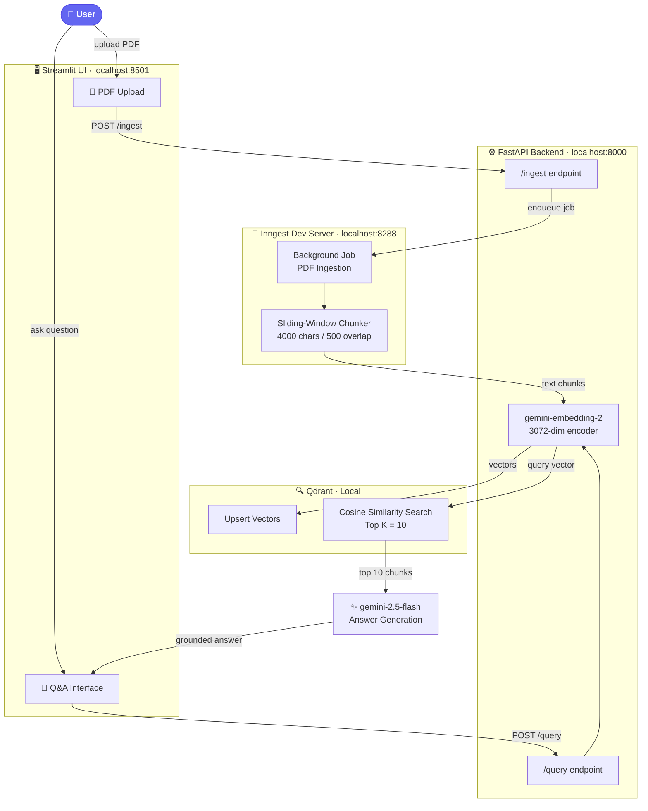
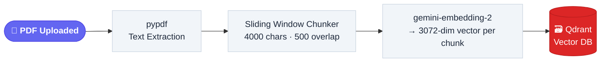
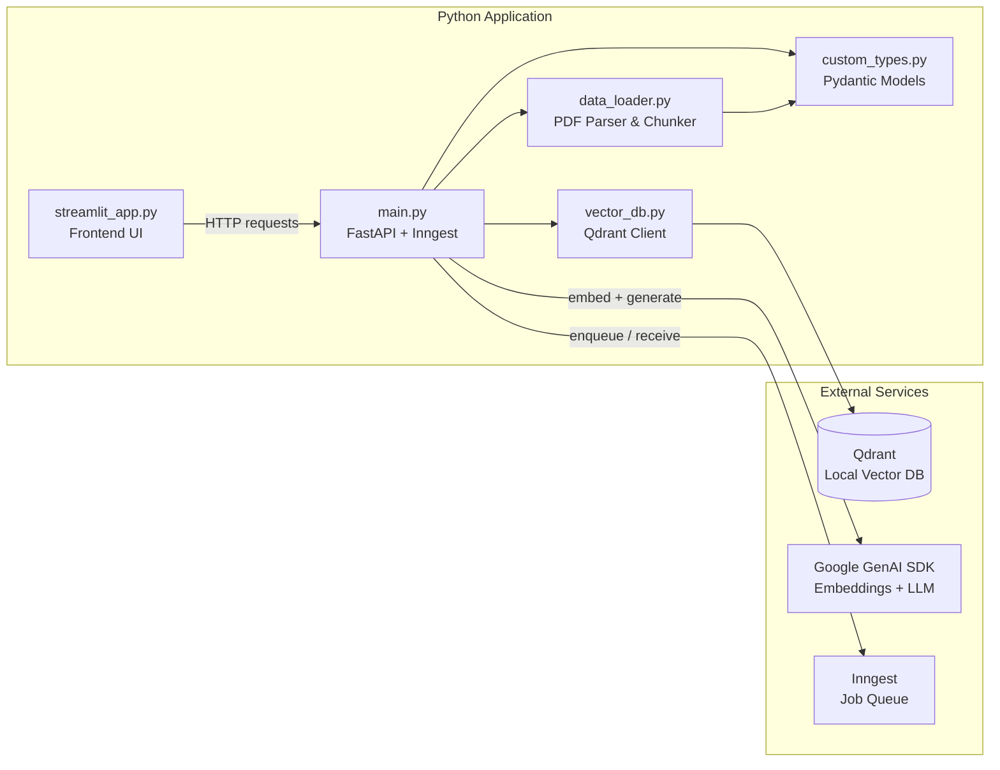

<div align="center">

<br/>

# 🧠 RAG Pipeline

### *Upload a PDF. Ask a question. Get a grounded, intelligent answer.*

<br/>

[](https://python.org)
[](https://fastapi.tiangolo.com)
[](https://streamlit.io)
[](https://ai.google.dev)
[](https://qdrant.tech)
[](https://inngest.com)
[](LICENSE)

<br/>

> A **production-grade Retrieval-Augmented Generation** system that transforms static PDFs into an interactive, queryable knowledge base — with zero hallucinations and full source grounding.

<br/>

[**Quick Start**](#%EF%B8%8F-setup--installation) · [**Architecture**](#-system-architecture) · [**Features**](#-features) · [**Usage**](#-usage)

</div>

---

## 🗺️ System Architecture

The application is built around three independently running services that communicate to form a complete RAG pipeline.

### High-Level Overview



---

### PDF Ingestion Pipeline



---

### Query & Answer Pipeline


---

### Module Dependency Map



---

## ✨ Features

| Feature | Detail |
|---|---|
| 📄 **Async PDF Ingestion** | Upload PDFs via Streamlit; Inngest handles chunking in a background job — no timeouts, no blocking |
| 🔪 **Sliding-Window Chunking** | 4,000-character chunks with 500-character overlaps preserve cross-boundary context perfectly |
| 🧠 **High-Dimensional Embeddings** | `gemini-embedding-2` produces 3,072-dimensional vectors for nuanced semantic representation |
| 🎯 **Top-K Retrieval** | Qdrant cosine-similarity search returns the 10 most relevant chunks per query |
| 🛡️ **Hallucination-Free Answers** | Prompt-engineered to answer strictly from document content — if it's not in the PDF, the model says so |
| ⚡ **Fast Generation** | `gemini-2.5-flash` delivers sub-second response times on most queries |
| 🧩 **Modular Codebase** | Clean separation: parser, vector DB, API, and UI are each independently replaceable |

---

## 🏗️ Tech Stack

| Layer | Technology | Purpose |
|---|---|---|
| **Frontend** | [Streamlit](https://streamlit.io) | PDF upload UI and Q&A chat interface |
| **Backend** | [FastAPI](https://fastapi.tiangolo.com) + Uvicorn | REST API, request routing, orchestration |
| **Job Queue** | [Inngest](https://inngest.com) | Reliable async background job execution |
| **PDF Parsing** | [pypdf](https://pypdf.readthedocs.io) | Extracts raw text from uploaded PDFs |
| **Embeddings** | `gemini-embedding-2` (Google) | Converts text to 3,072-dim semantic vectors |
| **Vector Store** | [Qdrant](https://qdrant.tech) (local) | Cosine-similarity nearest-neighbour search |
| **LLM** | `gemini-2.5-flash` (Google) | Grounded natural language answer generation |
| **Config** | `python-dotenv` | Secure API key management via `.env` |

---

## 📁 Project Structure

```
RAG-app/
│
├── main.py              # ⚙️  FastAPI app — API routes & Inngest function registration
├── streamlit_app.py     # 🖥️  Streamlit frontend — upload & Q&A interface
├── data_loader.py       # 📄  PDF parser & sliding-window text chunker
├── vector_db.py         # 🔍  Qdrant client — upsert embeddings & similarity search
├── custom_types.py      # 🧩  Pydantic models & shared type definitions
│
├── pyproject.toml       # 📦  Project metadata & dependency spec
├── uv.lock              # 🔒  Locked dependency versions
├── .python-version      # 🐍  Pinned Python version
└── .gitignore
```

---

## 🛠️ Setup & Installation

### Prerequisites

| Requirement | Version | Link |
|---|---|---|
| Python | 3.10+ | [python.org](https://python.org/downloads) |
| Node.js | Any LTS | [nodejs.org](https://nodejs.org) |
| Google Gemini API Key | — | [Get key →](https://aistudio.google.com/app/apikey) |

---

### Step 1 — Clone the Repository

```bash
git clone https://github.com/tanusingh04/RAG-app.git
cd RAG-app
```

---

### Step 2 — Configure Environment Variables

Create a `.env` file in the project root:

```ini
# .env
GEMINI_API_KEY="your_google_gemini_api_key_here"
```

> ⚠️ Never commit this file. It is already covered by `.gitignore`.

---

### Step 3 — Create a Virtual Environment & Install Dependencies

```bash
# Create the virtual environment
python -m venv .venv

# Activate — macOS / Linux
source .venv/bin/activate

# Activate — Windows
.venv\Scripts\activate

# Install all packages
pip install fastapi uvicorn streamlit qdrant-client google-genai inngest pypdf python-dotenv
```

> 💡 Or if a `requirements.txt` is present: `pip install -r requirements.txt`

---

## 💻 Running the Application

This app requires **three terminals running in parallel**. Start them in this order.

```
┌─────────────────────────┐  ┌──────────────────────────┐  ┌──────────────────────────┐
│   Terminal 1            │  │   Terminal 2             │  │   Terminal 3             │
│   Inngest Queue         │  │   FastAPI Backend        │  │   Streamlit UI           │
│   port :8288            │  │   port :8000             │  │   port :8501             │
├─────────────────────────┤  ├──────────────────────────┤  ├──────────────────────────┤
│                         │  │  source .venv/bin/activ  │  │  source .venv/bin/activ  │
│  npx inngest-cli@latest │  │  uvicorn main:app        │  │  streamlit run           │
│  dev                    │  │    --port 8000           │  │    streamlit_app.py      │
└─────────────────────────┘  └──────────────────────────┘  └──────────────────────────┘
        Start first                  Start second                  Start third
```

> ✅ Once all three are running, open **http://localhost:8501** in your browser.

---

## 📖 Usage

```
  1. 🌐  Open http://localhost:8501

  2. 📂  Find the "Upload a PDF to Ingest" section
          └── Browse and select your PDF file

  3. ⏳  Wait for the green ✅ success banner
          └── Inngest has chunked, embedded, and indexed your document

  4. 💬  Scroll to "Ask a question about your PDFs"
          └── Type your question and press Enter

  5. 🎯  Receive a grounded, structured answer
          └── Bullet points, bold text — strictly from your document
```

---

## ⚙️ Configuration Reference

| Parameter | Value | Location |
|---|---|---|
| `CHUNK_SIZE` | `4000` characters | `data_loader.py` |
| `CHUNK_OVERLAP` | `500` characters | `data_loader.py` |
| `TOP_K_RESULTS` | `10` chunks | `vector_db.py` |
| `EMBEDDING_DIMENSIONS` | `3072` | `gemini-embedding-2` default |
| `SIMILARITY_METRIC` | Cosine | Qdrant collection config |
| `GENERATION_MODEL` | `gemini-2.5-flash` | `main.py` |

---

## 🤝 Contributing

Contributions are welcome! Here's the workflow:

```bash
# 1. Fork and clone your fork
git clone https://github.com/YOUR_USERNAME/RAG-app.git

# 2. Create a feature branch
git checkout -b feature/your-feature-name

# 3. Make your changes and commit
git commit -m "feat: describe your change clearly"

# 4. Push and open a Pull Request
git push origin feature/your-feature-name
```

Please keep PRs focused with a clear description of what changed and why.

---

## 📜 License

This project is licensed under the **MIT License** — free to use, modify, and distribute.

---

<div align="center">

<br/>

**Built with 🧠 intelligence, ☕ caffeine, and a love for clean architecture.**

*Found this useful? Drop a ⭐ — it keeps the momentum going.*

[](https://github.com/tanusingh04/RAG-app/stargazers)
[](https://github.com/tanusingh04/RAG-app/network/members)

<br/>

</div>
